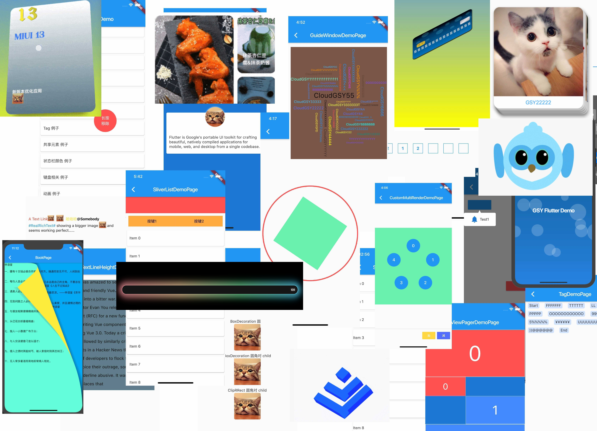

# GSY Flutter Demo

### 不同于 [GSYGithubAppFlutter](https://github.com/CarGuo/GSYGithubAppFlutter) 项目，本项目将逐步完善各种 Flutter 独立例子，方便新手学习上手。

### [Web 版在线测试](https://guoshuyu.cn/home/web/#/)

> 目前开始逐步补全完善，主要提供一些有用或者有趣的例子，如果你也有好例子，环境提交 PR 。
>
> **运行须知：配置好Flutter开发环境(目前Flutter SDK 版本 *1.12* 以上版本)。**
>
> **[如果克隆太慢，可尝试码云地址下载。](https://gitee.com/CarGuo/GSYFlutterDemo)**

### 已有例子

- **Controller 例子**
- **圆角 例子**
- **滑动监听 例子**
- **滑动到指定位置 例子**
- **滑动到指定位置2 例子**
- **Transform 例子**
- **文本行间距 例子**
- **多种下拉刷新 例子**
- **绝对定位 例子**
- **气泡提示框 例子**
- **标签Wrap 例子**
- **共享元素动画 例子**
- **修改状态栏颜色 例子**
- **系统键盘相关 例子**
- **动画相关 例子**
- **悬浮触摸控件 例子**
- **全局字体大小 例子**
- **富文本 例子**
- **ViewPager 例子**
- **滑动停靠 例子**
- **验证码输入框 例子**
- **自定义布局 例子**
- **自定义布局云词图 例子**
- **列表停靠 例子**
- **高斯模糊 例子**
- **多Tab动画列表 例子**
- **仿真翻页 例子**

### 相关文章

* ### [Flutter 完整实战实战系列文章专栏](https://juejin.im/collection/5db25bcff265da06a19a304e)
* ### [Flutter 番外的世界系列文章专栏](https://juejin.im/collection/5db25d706fb9a069f422c374)
* ### [目前各种主流状态管理演示Demo](https://github.com/CarGuo/state_manager_demo)

----

- ## [Flutter Github客户端](https://github.com/CarGuo/gsy_github_app_flutter) 

- ## [Flutter 完整开发实战详解 Gitbook 预览下载](https://github.com/CarGuo/GSYFlutterBook)

