# GSY Flutter Demo

### [English Document](README_EN.md)

### 不同于 [GSYGithubAppFlutter](https://github.com/CarGuo/GSYGithubAppFlutter) 项目，本项目将逐步完善各种 Flutter 独立例子，方便新手学习上手。

[](https://github.com/CarGuo/gsy_flutter_demo/actions)


## 相关文章

- ## [Flutter系列文章专栏](https://juejin.cn/column/6960546078202527774)

----

- ### 同款 Flutter 完整项目版本 （ https://github.com/CarGuo/gsy_github_app_flutter ）
* ### 同款 Android Compose 版本（ https://github.com/CarGuo/GSYGithubAppCompose ）
* ### 同款 React Native 版 （ https://github.com/CarGuo/GSYGithubApp ）
* ### 同款 Android Kotlin View 版本（ https://github.com/CarGuo/GSYGithubAppKotlin ）
* ### 同款 Weex 版 （ https://github.com/CarGuo/GSYGithubAppWeex ）

- ## [Flutter 完整开发实战详解 Gitbook 预览下载](https://github.com/CarGuo/gsy_flutter_book)


### [Web 版在线测试](https://guoshuyu.cn/home/web/#/)
### [APK 下载](https://github.com/CarGuo/gsy_flutter_demo/releases)

> 目前开始逐步补全完善，主要提供一些有用或者有趣的例子，如果你也有好例子，欢迎提交 PR 。
>
> **运行须知：配置好Flutter开发环境(目前Flutter SDK 版本 *3.35* 以上版本)。**
>
> **[如果克隆太慢或者图片看不到，可尝试从码云地址下载](https://gitee.com/CarGuo/GSYFlutterDemo)**

| 公众号   | 掘金     |  知乎    |  CSDN   |   简书   
|---------|---------|--------- |---------|---------|
| GSYTech  |  [点我](https://juejin.im/user/582aca2ba22b9d006b59ae68/posts)    |   [点我](https://www.zhihu.com/people/carguo)       |   [点我](https://blog.csdn.net/ZuoYueLiang)  |   [点我](https://www.jianshu.com/u/6e613846e1ea)  


|                  |                  |                  | 
|------------------|------------------|------------------|
| 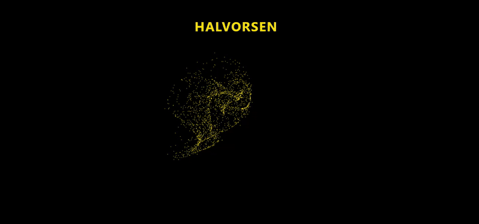   | 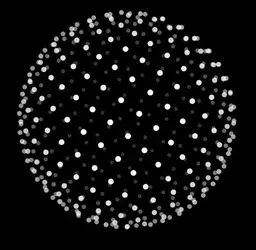  | 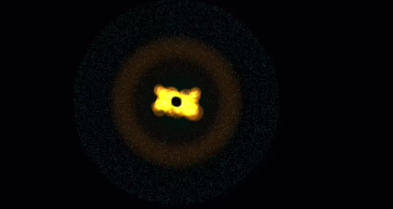  | 
| 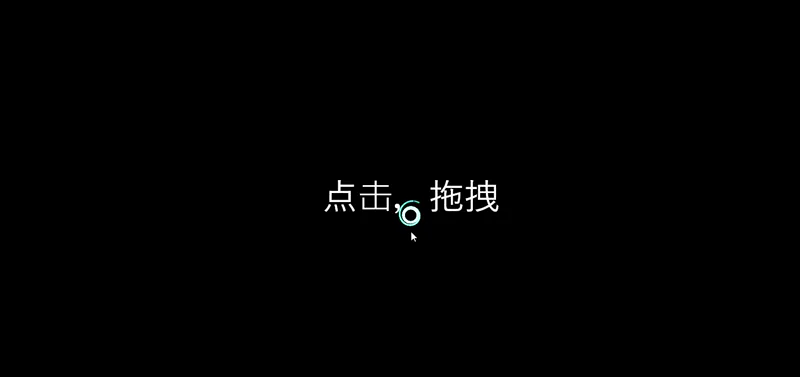  | 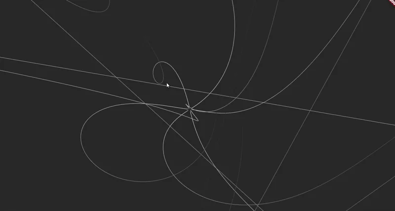  | 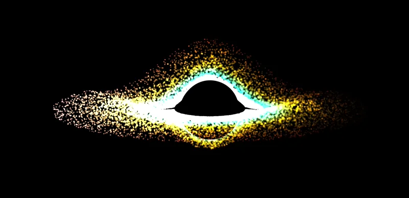  | 
| 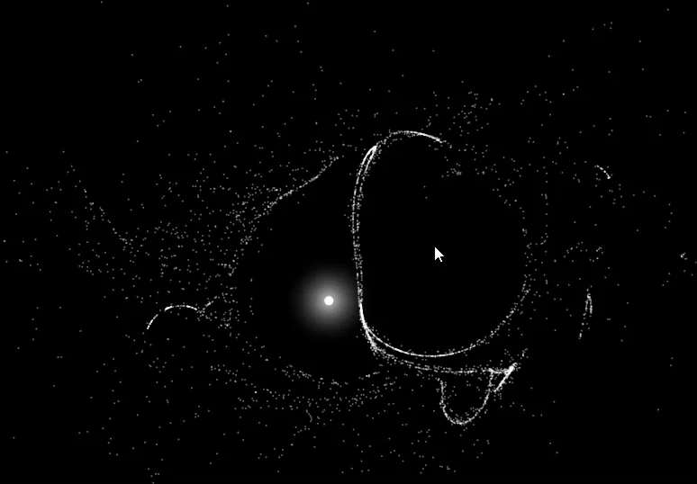  | 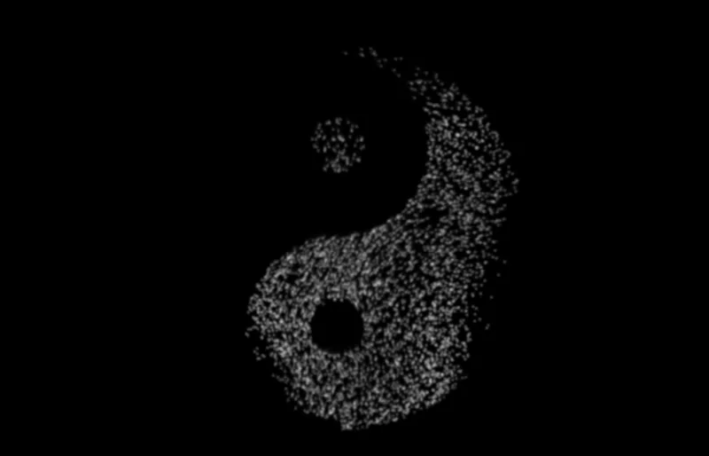  | 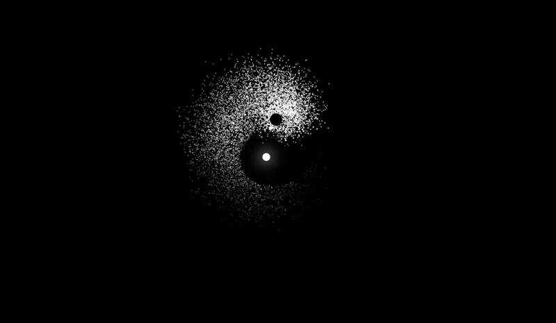  | 
| 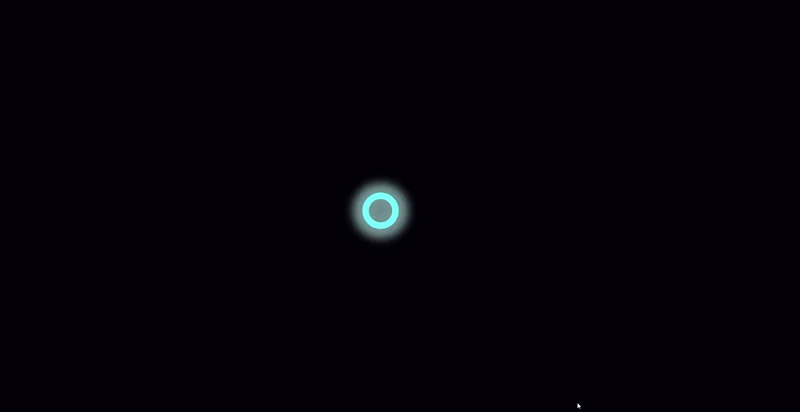 | 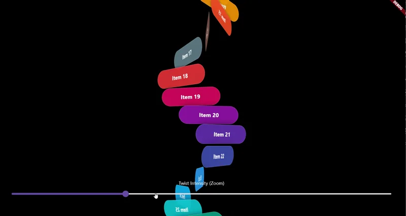 |  | 
| 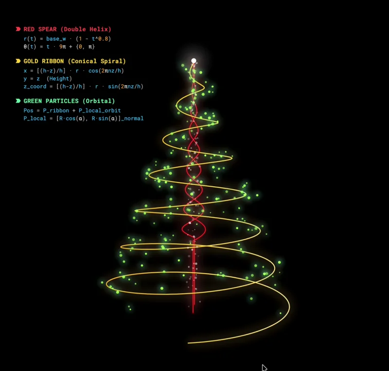 |   |   | 
|  |   |   | 


### 已有例子

```dart

Map<String, WidgetBuilder> routers = {
  "文本输入框简单的 Controller": (context) {
    return ContainerAsyncRouterPage(controller_demo_page.loadLibrary(),
            (context) {
          return controller_demo_page.ControllerDemoPage();
        });
  },
  "实现控件圆角不同组合": (context) {
    return ContainerAsyncRouterPage(clip_demo_page.loadLibrary(), (context) {
      return clip_demo_page.ClipDemoPage();
    });
  },
  "列表滑动监听": (context) {
    return ContainerAsyncRouterPage(scroll_listener_demo_page.loadLibrary(),
            (context) {
          return scroll_listener_demo_page.ScrollListenerDemoPage();
        });
  },
  "滑动到指定位置": (context) {
    return ContainerAsyncRouterPage(scroll_to_index_demo_page.loadLibrary(),
            (context) {
          return scroll_to_index_demo_page.ScrollToIndexDemoPage();
        });
  },
  "滑动到指定位置2": (context) {
    return ContainerAsyncRouterPage(scroll_to_index_demo_page2.loadLibrary(),
            (context) {
          return scroll_to_index_demo_page2.ScrollToIndexDemoPage2();
        });
  },
  "展示渐变带边框的文本": (context) {
    return ContainerAsyncRouterPage(gradient_text_demo_page.loadLibrary(),
            (context) {
          return gradient_text_demo_page.GradientTextDemoPage();
        });
  },
  "Transform 效果展示": (context) {
    return ContainerAsyncRouterPage(transform_demo_page.loadLibrary(),
            (context) {
          return transform_demo_page.TransformDemoPage();
        });
  },
  "计算另类文本行间距展示": (context) {
    return ContainerAsyncRouterPage(text_line_height_demo_page.loadLibrary(),
            (context) {
          return text_line_height_demo_page.TextLineHeightDemoPage();
        });
  },
  "简单上下刷新": (context) {
    return ContainerAsyncRouterPage(refrsh_demo_page.loadLibrary(), (context) {
      return refrsh_demo_page.RefreshDemoPage();
    });
  },
  "简单上下刷新2": (context) {
    return ContainerAsyncRouterPage(refrsh_demo_page2.loadLibrary(), (context) {
      return refrsh_demo_page2.RefreshDemoPage2();
    });
  },
  "简单上下刷新3": (context) {
    return ContainerAsyncRouterPage(refrsh_demo_page3.loadLibrary(), (context) {
      return refrsh_demo_page3.RefreshDemoPage3();
    });
  },
  "通过绝对定位布局": (context) {
    return ContainerAsyncRouterPage(positioned_demo_page.loadLibrary(),
            (context) {
          return positioned_demo_page.PositionedDemoPage();
        });
  },
  "气泡提示框": (context) {
    return ContainerAsyncRouterPage(bubble_demo_page.loadLibrary(), (context) {
      return bubble_demo_page.BubbleDemoPage();
    });
  },
  "Tag效果展示": (context) {
    return ContainerAsyncRouterPage(tag_demo_page.loadLibrary(), (context) {
      return tag_demo_page.TagDemoPage();
    });
  },
  "共享元素跳转效果": (context) {
    return ContainerAsyncRouterPage(honor_demo_page.loadLibrary(), (context) {
      return honor_demo_page.HonorDemoPage();
    });
  },
  "滑动验证": (context) {
    return ContainerAsyncRouterPage(silder_verify_page.loadLibrary(),
            (context) {
          return silder_verify_page.SlideVerifyPage();
        });
  },
  "warpContent实现": (context) {
    return ContainerAsyncRouterPage(wrap_content_page.loadLibrary(), (context) {
      return wrap_content_page.WrapContentPage();
    });
  },
  "状态栏颜色修改（仅 App）": (context) {
    return ContainerAsyncRouterPage(statusbar_demo_page.loadLibrary(),
            (context) {
          return statusbar_demo_page.StatusBarDemoPage();
        });
  },
  "键盘弹出与监听（仅 App）": (context) {
    return ContainerAsyncRouterPage(keyboard_demo_page.loadLibrary(),
            (context) {
          return keyboard_demo_page.KeyBoardDemoPage();
        });
  },
  "控件动画组合展示（旋转加放大圆）": (context) {
    return ContainerAsyncRouterPage(anima_demo_page.loadLibrary(), (context) {
      return anima_demo_page.AnimaDemoPage();
    });
  },
  "控件展开动画效果": (context) {
    return ContainerAsyncRouterPage(anima_demo_page2.loadLibrary(), (context) {
      return anima_demo_page2.AnimaDemoPage2();
    });
  },
  "全局悬浮按键效果": (context) {
    return ContainerAsyncRouterPage(floating_touch_demo_page.loadLibrary(),
            (context) {
          return floating_touch_demo_page.FloatingTouchDemoPage();
        });
  },
  "全局设置字体大小": (context) {
    return ContainerAsyncRouterPage(text_size_demo_page.loadLibrary(),
            (context) {
          return text_size_demo_page.TextSizeDemoPage();
        });
  },
  "旧版实现富文本": (context) {
    return ContainerAsyncRouterPage(rich_text_demo_page.loadLibrary(),
            (context) {
          return rich_text_demo_page.RichTextDemoPage();
        });
  },
  "官方实现富文本": (context) {
    return ContainerAsyncRouterPage(rich_text_demo_page2.loadLibrary(),
            (context) {
          return rich_text_demo_page2.RichTextDemoPage2();
        });
  },
  "第三方 viewpager 封装实现": (context) {
    return ContainerAsyncRouterPage(viewpager_demo_page.loadLibrary(),
            (context) {
          return viewpager_demo_page.ViewPagerDemoPage();
        });
  },
  "列表滑动过程控件停靠效果": (context) {
    return ContainerAsyncRouterPage(sliver_list_demo_page.loadLibrary(),
            (context) {
          return sliver_list_demo_page.SliverListDemoPage();
        });
  },
  "验证码输入框": (context) {
    return ContainerAsyncRouterPage(
        verification_code_input_demo_page.loadLibrary(), (context) {
      return verification_code_input_demo_page.VerificationCodeInputDemoPage();
    });
  },
  "验证码输入框2": (context) {
    return ContainerAsyncRouterPage(
        verification_code_input_demo_page2.loadLibrary(), (context) {
      return verification_code_input_demo_page2
          .VerificationCodeInputDemoPage2();
    });
  },
  "自定义布局展示效果": (context) {
    return ContainerAsyncRouterPage(custom_multi_render_demo_page.loadLibrary(),
            (context) {
          return custom_multi_render_demo_page.CustomMultiRenderDemoPage();
        });
  },
  "自定义布局实现云词图展示": (context) {
    return ContainerAsyncRouterPage(cloud_demo_page.loadLibrary(), (context) {
      return cloud_demo_page.CloudDemoPage();
    });
  },
  "列表滑动停靠 （Stick）": (context) {
    return ContainerAsyncRouterPage(stick_demo_page.loadLibrary(), (context) {
      return stick_demo_page.StickDemoPage();
    });
  },
  "列表滑动停靠 （Stick）+ 展开收回": (context) {
    return ContainerAsyncRouterPage(stick_demo_page2.loadLibrary(), (context) {
      return stick_demo_page2.StickExpendDemoPage();
    });
  },
  "列表滑动停靠效果2 （Stick": (context) {
    return ContainerAsyncRouterPage(sliver_stick_demo_page.loadLibrary(),
            (context) {
          return sliver_stick_demo_page.SliverStickListDemoPage();
        });
  },
  "键盘顶起展示（仅 App）": (context) {
    return ContainerAsyncRouterPage(input_bottom_demo_page.loadLibrary(),
            (context) {
          return input_bottom_demo_page.InputBottomDemoPage();
        });
  },
  "Blur 高斯模糊效果": (context) {
    return ContainerAsyncRouterPage(blur_demo_page.loadLibrary(), (context) {
      return blur_demo_page.BlurDemoPage();
    });
  },
  "控件动画变形效果": (context) {
    return ContainerAsyncRouterPage(animation_container_demo_page.loadLibrary(),
            (context) {
          return animation_container_demo_page.AnimationContainerDemoPage();
        });
  },
  "时钟动画绘制展示": (context) {
    return ContainerAsyncRouterPage(tick_click_demo_page.loadLibrary(),
            (context) {
          return tick_click_demo_page.TickClickDemoPage();
        });
  },
  "按键切换动画效果": (context) {
    return ContainerAsyncRouterPage(anima_demo_page4.loadLibrary(), (context) {
      return anima_demo_page4.AnimaDemoPage4();
    });
  },
  "列表滑动过程 item 停靠动画效果": (context) {
    return ContainerAsyncRouterPage(list_anim_demo_page.loadLibrary(),
            (context) {
          return list_anim_demo_page.ListAnimDemoPage();
        });
  },
  "列表滑动过程 item 停靠动画效果2": (context) {
    return ContainerAsyncRouterPage(list_anim_demo_page2.loadLibrary(),
            (context) {
          return list_anim_demo_page2.ListAnimDemoPage2();
        });
  },
  "下弹筛选展示效果": (context) {
    return ContainerAsyncRouterPage(drop_select_demo_page.loadLibrary(),
            (context) {
          return drop_select_demo_page.DropSelectDemoPage();
        });
  },
  "文本弹出动画效果": (context) {
    return ContainerAsyncRouterPage(anima_demo_page5.loadLibrary(), (context) {
      return anima_demo_page5.AnimaDemoPage5();
    });
  },
  "强大的自定义滑动与停靠结合展示": (context) {
    return ContainerAsyncRouterPage(scroll_header_demo_page.loadLibrary(),
            (context) {
          return scroll_header_demo_page.ScrollHeaderDemoPage();
        });
  },
  "自定义列表内sliver渲染顺序": (context) {
    return ContainerAsyncRouterPage(custom_viewport_page.loadLibrary(),
            (context) {
          return custom_viewport_page.CustomViewportPage();
        });
  },
  "点击弹出动画提示": (context) {
    return ContainerAsyncRouterPage(anim_tip_demo_page.loadLibrary(),
            (context) {
          return anim_tip_demo_page.AnimTipDemoPage();
        });
  },
  "列表停靠展开+回到当前头部": (context) {
    return ContainerAsyncRouterPage(stick_sliver_list_demo_page.loadLibrary(),
            (context) {
          return stick_sliver_list_demo_page.StickSliverListDemoPage();
        });
  },
  "使用 overflow 处理图片": (context) {
    return ContainerAsyncRouterPage(overflow_image_page.loadLibrary(),
            (context) {
          return overflow_image_page.OverflowImagePage();
        });
  },
  "展示 Align 排布控件": (context) {
    return ContainerAsyncRouterPage(align_demo_page.loadLibrary(), (context) {
      return align_demo_page.AlignDemoPage();
    });
  },
  "通过不同尺寸计算方式展示比例": (context) {
    return ContainerAsyncRouterPage(card_item_page.loadLibrary(), (context) {
      return card_item_page.CardItemPage();
    });
  },
  "多列表+顶部Tab效果展示": (context) {
    return ContainerAsyncRouterPage(sliver_tab_demo_page.loadLibrary(),
            (context) {
          return sliver_tab_demo_page.SliverTabDemoPage();
        });
  },
  "多列表+顶部Tab效果展示2": (context) {
    return ContainerAsyncRouterPage(sliver_tab_demo_page2.loadLibrary(),
            (context) {
          return sliver_tab_demo_page2.SliverTabDemoPage2();
        });
  },
  "多列表+顶部Tab效果展示3": (context) {
    return ContainerAsyncRouterPage(sliver_tab_demo_page3.loadLibrary(),
            (context) {
          return sliver_tab_demo_page3.SliverTabDemoPage3();
        });
  },
  "仿真书本翻页动画（仅APP）": (context) {
    return ContainerAsyncRouterPage(book_page.loadLibrary(), (context) {
      return book_page.BookPage();
    });
  },
  "粒子动画效果": (context) {
    return ContainerAsyncRouterPage(particle_page.loadLibrary(), (context) {
      return particle_page.ParticlePage();
    });
  },
  "动画背景效果": (context) {
    return ContainerAsyncRouterPage(anim_bg_demo_page.loadLibrary(), (context) {
      return anim_bg_demo_page.AnimBgDemoPage();
    });
  },
  "手势效果": (context) {
    return ContainerAsyncRouterPage(matrix_custom_painter_page.loadLibrary(),
            (context) {
          return matrix_custom_painter_page.MatrixCustomPainterDemo();
        });
  },
  "一个有趣的底部跟随和停靠例子": (context) {
    return ContainerAsyncRouterPage(
        scroll_inner_content_demo_page.loadLibrary(), (context) {
      return scroll_inner_content_demo_page.ScrollInnerContentDemoPage();
    });
  },
  "一个有趣的圆形选择器": (context) {
    return ContainerAsyncRouterPage(bottom_anim_nav_page.loadLibrary(),
            (context) {
          return bottom_anim_nav_page.BottomAnimNavPage();
        });
  },
  "一个类似探探堆叠卡片例子": (context) {
    return ContainerAsyncRouterPage(
        index_stack_drag_card_demo_page.loadLibrary(), (context) {
      return index_stack_drag_card_demo_page.IndexStackDragCardDemoPage();
    });
  },
  "一个类似探探堆叠卡片例子2": (context) {
    return ContainerAsyncRouterPage(
        index_stack_drag_card_demo_page2.loadLibrary(), (context) {
      return index_stack_drag_card_demo_page2.IndexStackDragCardDemoPage2();
    });
  },
  "动画按键例子": (context) {
    return ContainerAsyncRouterPage(anim_button_demo_page.loadLibrary(),
            (context) {
          return anim_button_demo_page.AnimButtonDemoPage();
        });
  },
  "类似QQ发送图片的动画": (context) {
    return ContainerAsyncRouterPage(anim_progress_img_demo_page.loadLibrary(),
            (context) {
          return anim_progress_img_demo_page.AnimProgressImgDemoPage();
        });
  },
  "类似探探扫描的动画效果": (context) {
    return ContainerAsyncRouterPage(anim_scan_demo_page.loadLibrary(),
            (context) {
          return anim_scan_demo_page.AnimScanDemoPage();
        });
  },
  "圆弧形的 SeekBar（仅APP）": (context) {
    return ContainerAsyncRouterPage(arc_seek_bar_demo_page.loadLibrary(),
            (context) {
          return arc_seek_bar_demo_page.ArcSeekBarDemoPage();
        });
  },
  "一个国外友人很惊艳的动画效果": (context) {
    return ContainerAsyncRouterPage(anim_bubble_gum.loadLibrary(), (context) {
      return anim_bubble_gum.AnimBubbleGumDemoPage();
    });
  },
  "纯 Canvas 绘制闹钟": (context) {
    return ContainerAsyncRouterPage(canvas_click_demo_page.loadLibrary(),
            (context) {
          return canvas_click_demo_page.CanvasClickDemoPage();
        });
  },
  "类似 boss 直聘我的页面联动效果": (context) {
    return ContainerAsyncRouterPage(link_sliver_demo_page.loadLibrary(),
            (context) {
          return link_sliver_demo_page.LinkSliverDemoPage();
        });
  },
  "结合 Matrix 的拖拽": (context) {
    return ContainerAsyncRouterPage(drag_img_demo_page.loadLibrary(),
            (context) {
          return drag_img_demo_page.DragImgDemoPage();
        });
  },
  "彩色进度条": (context) {
    return ContainerAsyncRouterPage(color_progress_demo_page.loadLibrary(),
            (context) {
          return color_progress_demo_page.ColorProgressDemoPage();
        });
  },
  "第三方的动画字体": (context) {
    return ContainerAsyncRouterPage(anim_text_demo_page.loadLibrary(),
            (context) {
          return anim_text_demo_page.AnimTextDemoPage();
        });
  },
  "首尾添加数据不会抖动": (context) {
    return ContainerAsyncRouterPage(chat_list_scroll_demo_page.loadLibrary(),
            (context) {
          return chat_list_scroll_demo_page.ChatListScrollDemoPage();
        });
  },
  "首尾添加数据不会抖动2": (context) {
    return ContainerAsyncRouterPage(chat_list_scroll_demo_page_2.loadLibrary(),
            (context) {
          return chat_list_scroll_demo_page_2.ChatListScrollDemoPage2();
        });
  },
  "测试路由嵌套": (context) {
    return ContainerAsyncRouterPage(route_demo_page.loadLibrary(), (context) {
      return route_demo_page.RouteDemoPage();
    });
  },
  "测试 canvas 阴影": (context) {
    return ContainerAsyncRouterPage(shader_canvas_demo_page.loadLibrary(),
            (context) {
          return shader_canvas_demo_page.ShaderCanvasDemoPage();
        });
  },
  "控件动画切换效果": (context) {
    ///对应文章解析  https://juejin.cn/post/7111071430292275213
    return ContainerAsyncRouterPage(anim_switch_layout_demo_page.loadLibrary(),
            (context) {
          return anim_switch_layout_demo_page.AnimSwitchLayoutDemoPage();
        });
  },
  "ListView 嵌套 ViewPager 解决斜着滑动问题": (context) {
    ///对应文章解析 https://juejin.cn/post/7116267156655833102
    return ContainerAsyncRouterPage(vp_list_demo_page.loadLibrary(), (context) {
      return vp_list_demo_page.VPListView();
    });
  },
  "垂直  ViewPager 嵌套垂直 ListView ": (context) {
    ///对应文章解析 https://juejin.cn/post/7116267156655833102
    return ContainerAsyncRouterPage(vp_list_demo_page.loadLibrary(), (context) {
      return vp_list_demo_page.VPNestListView();
    });
  },
  "垂直  ListView 嵌套垂直  ViewPager": (context) {
    ///对应文章解析 https://juejin.cn/post/7116267156655833102
    return ContainerAsyncRouterPage(vp_list_demo_page.loadLibrary(), (context) {
      return vp_list_demo_page.ListViewNestVP();
    });
  },
  "垂直  ListView 联动  ListView": (context) {
    ///对应文章解析 https://juejin.cn/post/7116267156655833102
    return ContainerAsyncRouterPage(vp_list_demo_page.loadLibrary(), (context) {
      return vp_list_demo_page.ListViewLinkListView();
    });
  },
  "3D 透视卡片": (context) {
    ///对应文章解析  https://juejin.cn/post/7124064789763981326
    return ContainerAsyncRouterPage(card_perspective_demo_page.loadLibrary(),
            (context) {
          return card_perspective_demo_page.CardPerspectiveDemoPage();
        });
  },
  "3D 卡片旋转": (context) {
    ///对应文章解析  https://juejin.cn/post/7124064789763981326
    return ContainerAsyncRouterPage(card_3d_demo_page.loadLibrary(), (context) {
      return card_3d_demo_page.Card3DDemoPage();
    });
  },
  "硬核 3D 卡片旋转": (context) {
    ///对应文章解析 https://juejin.cn/post/7129239231473385503
    return ContainerAsyncRouterPage(card_real_3d_demo_page.loadLibrary(),
            (context) {
          return card_real_3d_demo_page.CardReal3DDemoPage();
        });
  },
  "3D Dash": (context) {
    ///对应文章解析 https://juejin.cn/post/7129239231473385503
    return ContainerAsyncRouterPage(dash_3d_demo_page.loadLibrary(), (context) {
      return dash_3d_demo_page.Dash3dDemoPage();
    });
  },
  "展示 canvas transform": (context) {
    ///对应文章解析 https://juejin.cn/post/7129239231473385503
    return ContainerAsyncRouterPage(transform_canvas_demo_page.loadLibrary(),
            (context) {
          return transform_canvas_demo_page.TransformCanvasDemoPage();
        });
  },
  "rive 掘金 logo": (context) {
    ///对应文章解析  https://juejin.cn/post/7126661045564735519
    return ContainerAsyncRouterPage(anim_juejin_logo_demo_page.loadLibrary(),
            (context) {
          return anim_juejin_logo_demo_page.AnimJueJinLogoDemoPage();
        });
  },
  "掘金 3d logo": (context) {
    ///对应文章解析 https://juejin.cn/post/7129239231473385503
    return ContainerAsyncRouterPage(juejin_3d_logo_demo_page.loadLibrary(),
            (context) {
          return juejin_3d_logo_demo_page.JueJin3DLogoDemoPage();
        });
  },
  "掘金更 3d logo": (context) {
    ///对应文章解析 https://juejin.cn/post/7129239231473385503
    return ContainerAsyncRouterPage(juejin_3d_box_logo_demo_page.loadLibrary(),
            (context) {
          return juejin_3d_box_logo_demo_page.JueJin3DBoxLogoDemoPage();
        });
  },
  "png shadow": (context) {
    return ContainerAsyncRouterPage(png_shadow_demo_page.loadLibrary(),
            (context) {
          return png_shadow_demo_page.PngShadowDemoPage();
        });
  },
  "path 路径 png 效果": (context) {
    return ContainerAsyncRouterPage(custom_shader_path_demo_page.loadLibrary(),
            (context) {
          return custom_shader_path_demo_page.CustomShaderPathDemoPage();
        });
  },
  "列表联动 BottomSheet 效果": (context) {
    return ContainerAsyncRouterPage(
        list_link_bottomsheet_demo_page.loadLibrary(), (context) {
      return list_link_bottomsheet_demo_page.ListLinkBottomSheetDemoPage();
    });
  },
  "DraggableSheet 的 stick 效果": (context) {
    return ContainerAsyncRouterPage(
        demo_draggable_sheet_stick_page.loadLibrary(), (context) {
      return demo_draggable_sheet_stick_page.DemoDraggableSheetStickPage();
    });
  },
  "异步调用的顺序执行": (context) {
    return ContainerAsyncRouterPage(async_to_sync_call_page.loadLibrary(),
            (context) {
          return async_to_sync_call_page.AsyncToSyncCallPage();
        });
  },
  "点击爆炸的五角星（ChatGPT 生成代码）": (context) {
    return ContainerAsyncRouterPage(star_bomb_button_page.loadLibrary(),
            (context) {
          return star_bomb_button_page.StarBombButtonPage();
        });
  },
  "有趣画廊": (context) {
    return ContainerAsyncRouterPage(photo_gallery_demo_page.loadLibrary(),
            (context) {
          return photo_gallery_demo_page.PhotoGalleryDemoPage();
        });
  },
  "有趣的文本撕裂动画": (context) {
    return ContainerAsyncRouterPage(tear_text_demo_page.loadLibrary(),
            (context) {
          return tear_text_demo_page.TearTextDemoPage();
        });
  },
  "自适应横竖列表": (context) {
    return ContainerAsyncRouterPage(un_bounded_listview.loadLibrary(),
            (context) {
          return un_bounded_listview.UnboundedListViewDemoPage();
        });
  },
  "PageView嵌套PageView": (context) {
    return ContainerAsyncRouterPage(
        pageview_in_pageview_demo_page.loadLibrary(), (context) {
      return pageview_in_pageview_demo_page.PageViewInPageViewDemoPage();
    });
  },
  "手势密码": (context) {
    return ContainerAsyncRouterPage(gesture_password_demo_page.loadLibrary(),
            (context) {
          return gesture_password_demo_page.GesturePasswordDemoPage();
        });
  },
  "link scroll": (context) {
    return ContainerAsyncRouterPage(link_scroll_page.loadLibrary(), (context) {
      return link_scroll_page.LinkListViewPage();
    });
  },
  "glass": (context) {
    return ContainerAsyncRouterPage(glass_demo_page.loadLibrary(), (context) {
      return glass_demo_page.GlassDemoPage();
    });
  },
  "liquid glass": (context) {
    return ContainerAsyncRouterPage(liquid_glass_demo.loadLibrary(), (context) {
      return liquid_glass_demo.LiquidGlassShaderView();
    });
  },
  "liquid glass 2": (context) {
    return ContainerAsyncRouterPage(liquid_glass_demo2.loadLibrary(),
            (context) {
          return liquid_glass_demo2.LiquidGlassShaderView2();
        });
  },
  "粒子动画": (context) {
    return ContainerAsyncRouterPage(attractor_page.loadLibrary(),
            (context) {
          return attractor_page.AttractorPage();
        });
  },
  "星云动画": (context) {
    return ContainerAsyncRouterPage(galaxy_scene_page.loadLibrary(), (context) {
      return galaxy_scene_page.GalaxyScene();
    });
  },
  "霓虹滑块，100%高亮": (context) {
    return ContainerAsyncRouterPage(neon_slider_page.loadLibrary(), (context) {
      return neon_slider_page.NeonSliderPage();
    });
  },
  "Radial lines": (context) {
    return ContainerAsyncRouterPage(radial_lines_page.loadLibrary(), (context) {
      return radial_lines_page.RadialLinesPage();
    });
  },
  "炫酷爆炸粒子": (context) {
    return ContainerAsyncRouterPage(radial_lines_page.loadLibrary(), (context) {
      return boom_particle_page.BoomParticlePage();
    });
  },
  "Black hole": (context) {
    return ContainerAsyncRouterPage(black_hole_simulation_page.loadLibrary(),
            (context) {
          return black_hole_simulation_page.BlackHoleSimulation();
        });
  },
  "流体太极": (context) {
    return ContainerAsyncRouterPage(stream_taichi_page.loadLibrary(),
            (context) {
          return stream_taichi_page.NebulaTaiChiPage();
        });
  },
  "黑洞流体": (context) {
    return ContainerAsyncRouterPage(black_hole_page.loadLibrary(),
            (context) {
          return black_hole_page.GalaxyParticleScreen();
        });
  },
  "太极粒子": (context) {
    return ContainerAsyncRouterPage(taichi_page.loadLibrary(), (context) {
      return taichi_page.TaiChiMasterpiece();
    });
  },
  "破坏杀·罗针": (context) {
    return ContainerAsyncRouterPage(akaza_page.loadLibrary(), (context) {
      return akaza_page.AkazaCompassPage();
    });
  },
  "骚气滑动列表": (context) {
    return ContainerAsyncRouterPage(tornado_scroll_demo.loadLibrary(),
            (context) {
          return tornado_scroll_demo.TornadoScrollDemo();
        });
  },
  "骚气粒子效果": (context) {
    return ContainerAsyncRouterPage(particle_morphing_page.loadLibrary(),
            (context) {
          return particle_morphing_page.ParticleMorphingPage();
        });
  },
  "炫酷圣诞树": (context) {
    return ContainerAsyncRouterPage(combined_scene_page.loadLibrary(),
            (context) {
          return combined_scene_page.CombinedScenePage();
        });
  },
  "炫酷二维码": (context) {
    return ContainerAsyncRouterPage(notion_qrcode_page.loadLibrary(),
            (context) {
          return notion_qrcode_page.NotionFinalQRCodeEntryPage();
        });
  },
  "Cool Disco Sphere": (context) {
    return ContainerAsyncRouterPage(disco_sphere_page.loadLibrary(),
            (context) {
          return disco_sphere_page.DiscoSphereFinalFusionPage();
        });
  },
  "Cool Spatial Grid": (context) {
    return ContainerAsyncRouterPage(spatial_grid_page.loadLibrary(), (context) {
      return spatial_grid_page.SpatialGridPage();
    });
  },
  "Shock Wave Chat": (context) {
    return ContainerAsyncRouterPage(shock_wave_chat_page.loadLibrary(),
            (context) {
          return shock_wave_chat_page.ShockwaveChatPage();
        });
  }
};
```


### 指定web地址而不是 localhost 的运行命令

```
flutter run -d web-server --web-hostname 127.0.0.1 --web-port 8989

flutter build web --web-renderer canvaskit 指定渲染模式
flutter build web --release --web-renderer html 

cp -r ./build/app/intermediates/flutter/release/flutter_assets/ ./build/web/assets

```

### 相关文章

- ### [各种最新 Flutter 文章](https://juejin.im/user/582aca2ba22b9d006b59ae68/posts)
- ### [Flutter 完整实战实战系列文章专栏](http://mp.weixin.qq.com/mp/homepage?__biz=Mzg3NTA3MDIxOA==&hid=2&sn=679ad0212470f5155c4412e678411374&scene=18#wechat_redirect)
- ### [Flutter 番外的世界系列文章专栏](http://mp.weixin.qq.com/mp/homepage?__biz=Mzg3NTA3MDIxOA==&hid=3&sn=bf37119ae2b741a1c71125538bf0cd8d&scene=18#wechat_redirect)


----

- ## [Flutter Github客户端](https://github.com/CarGuo/gsy_github_app_flutter) 

- ## [Flutter 完整开发实战详解 Gitbook 预览下载](https://github.com/CarGuo/GSYFlutterBook)


